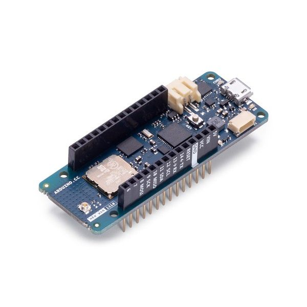
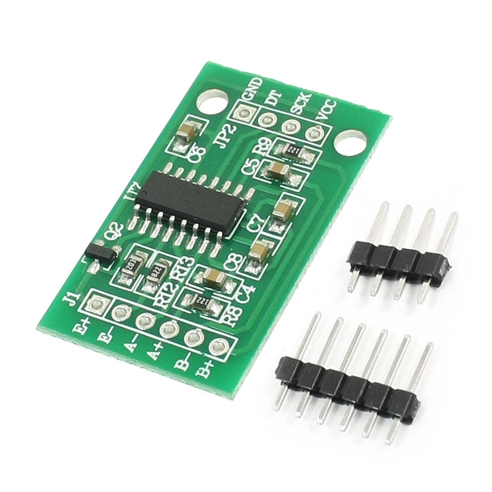
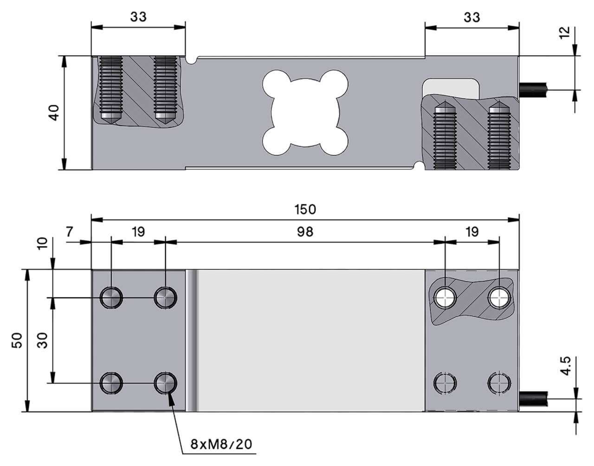
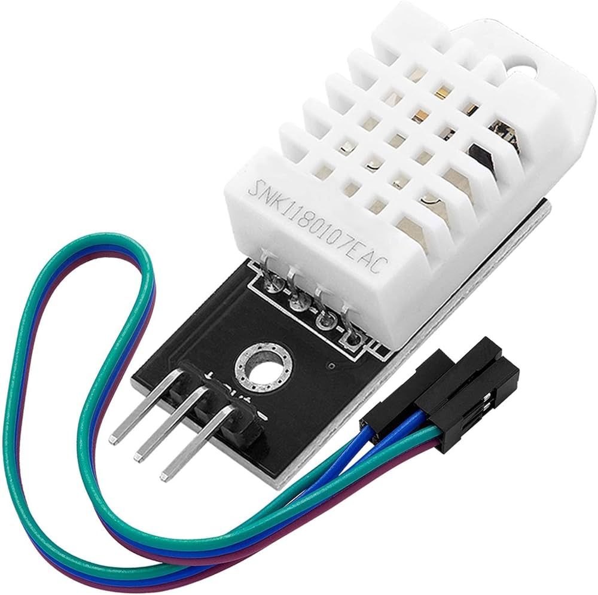
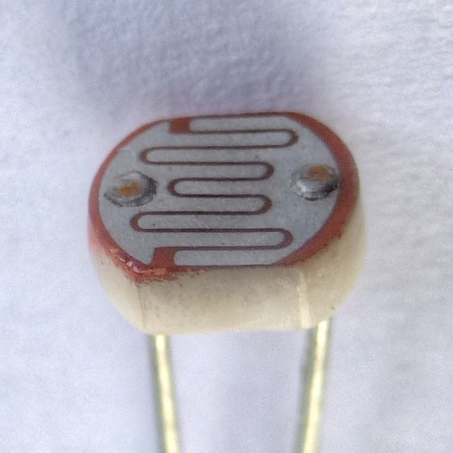
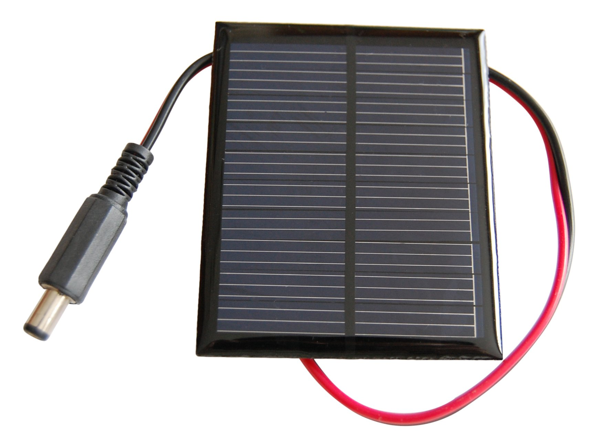
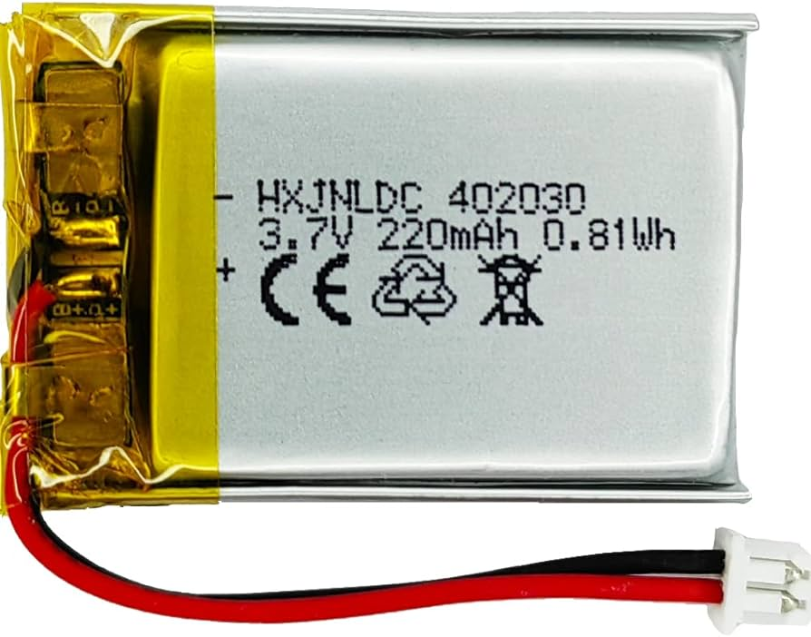
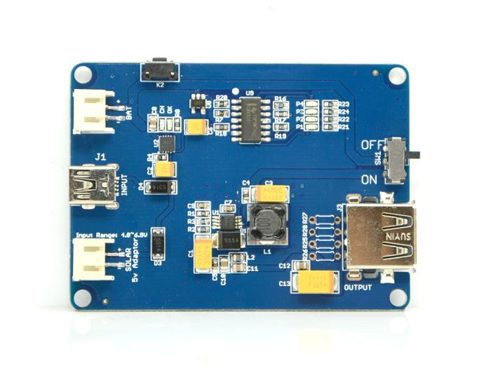
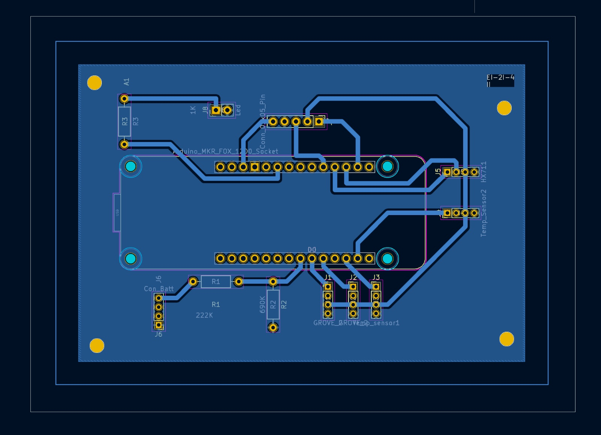
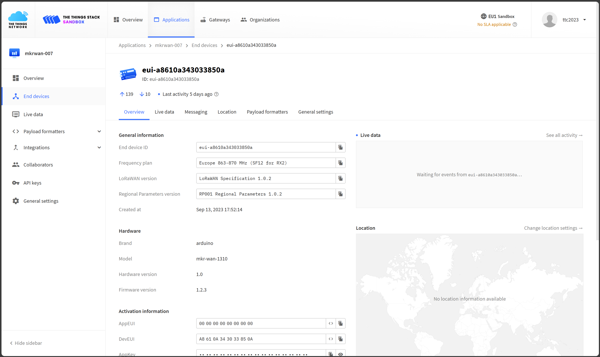

# Our commitment

Our mission throughout the months has been to built a real-time beehive
monitoring solution for beehives’ owners.  
It is more than ever a need for them, knowing that the world’s bee
population is facing a lot of issues as climate change, habitat loss,
pesticide exposure, predators...

# Hardware development

## The components

This part will be focused on the components used in the development of
the beehive.  
You will learn why we used them and later we will explained how
implement them in your version.

### Arduino MKRWAN

It is an arduino compatible board designed for LoRaWAN communication,
with a low power consumption and a compact size, making it the perfect
solution.



### HX711 Load Cell Amplifier

This component is used in order to monitor the beehive’s weight.  
The weight is a key information because it is an indicator of the hive’s
growth.  
The low-noise analog-to-digital conversion enhance the component’s
accuracy.



### H401-C3 Load Cell

Connected to HX711 Amplifier this load cell offers high precision and
stability.  
Indeed, it is known for its durability and resistance to environmental
factors.



### DHT22 Temperature and Humidity Sensors

A hive must have a temperature between 33 and 36 degrees Celsius.  
DHT22 sensors offers a high accuracy to measure both temperature and
humidity.  
The single-wire digital interface ensure a reliable and consistent
readings even in challenging environments.



### OneWire Protocol Compatible Temperature Sensors, DS18B20

It provides precise temperature readings for external conditions around
the beehive. These sensors offers an accurate reading of the ambient
environment that the bees are exposed to.


### Photoresistor

A photoresistor is integrated into the system to measure ambient light
conditions surrounding the beehive



### Solar panel

We use it in order to maintain the battery’s charge and to
continuously recharge the LiPo battery during daylight hours.



### Battery with TPL5110 for Power Management

Powered by a rechargeable LiPo battery[^1], it enhances the autonomy,
and the energy efficiency.  
Indeed, it ensures that the system operates only when necessary.  
There is two main information about the LiPo battery:

1.  It has a nominal voltage of 3.7V and a maximum voltage of 4.2V.

2.  The LiPo’s capacity is rated at 1050mAh. In order to realize the
    battery consumption analysis, we used an Otii ARC-PRO from
    Quoitech.  
    You will find in the "References" section a tutorial in order to get
    started with the device.  





# PCB Schematic

Before the making of a PCB Schematic, we made tests on a Labdec and we
strongly advise you to do so.  
Once our Labdec worked, we built our PCB Schematic on the same modele.



As you can see, the Arduino MKRWAN pins are redirected to different grove connectors.

The grove connectors are listed below:

- **J1:** Grove connector for the OneWire temperature sensors
- **J2:** Grove connector for the photoresistor
- **J3 & J4:** Connects to the DHT22 temperature and humidity sensors
- **J5:** Grove connector for the HX711 Load Cell Amplifier
- **J6:** Connects to the battery, a voltage divider made of two resistors is integrated in order to measure the battery voltage.
- **J8:** Connects to a LED, it is used to indicate the system’s state.

There is also a 5-pins connector above the Arduino MKRWAN. It is used to connect the TPL5110 to the Arduino MKRWAN. From the second pin to the right, you can notice a wire that connects to the VCC pin of J1-J6. It is used to power the grove connectors only when the system needs to gather data upon emission.


# Software development

This documentation provides a comprehensive overview of the Arduino code used in the Alvearium project. The code is designed for environmental monitoring and data transmission using LoRa connectivity. It includes sensor initialization, data collection, and communication setup.
## Code Structure
### Header Inclusions

```cpp
#include "includes/LoraConnection.hpp"
#include <DHT.h>
#include <OneWire.h>
#include <DallasTemperature.h>
#include <HX711.h>
#include <math.h>
```

 
- `LoraConnection.hpp`: Custom header for LoRa communication handling. 
- `DHT.h`: Library for the DHT22 humidity and temperature sensors. 
- `OneWire.h`: Library for the one-wire protocol, used with Dallas temperature sensors. 
- `DallasTemperature.h`: Library for interfacing with the DallasTemperature sensors. 
- `HX711.h`: Library for the HX711 load cell amplifier. 
- `math.h`: Standard math library for calculations.
### Pin Definitions

```cpp
#define TPL5110_DELAY 10
#define TPL5110_DONE 7
#define DHT22_INTERIOR 4
#define DHT22_EXTERIOR 0
#define ONE_WIRE_BUS 3
#define LOADCELL_DOUT_PIN 8
#define LOADCELL_SCK_PIN 9
#define PERCENTAGE_PIN A6
#define PHOTO_PIN A3
```


- Defines the GPIO pins for various components like TPL5110 power management, DHT22 sensors, and the load cell.
### LoRa Credentials

```cpp
#define APP_EUI "0000000000000000"
#define APP_KEY "C8DFDC187A8281E778015F091DDE04DF"
```


- Credentials for LoRaWAN communication setup.
### Sensor Initializations

```cpp
DHT dhtInterrior(DHT22_INTERIOR, DHT22);
DHT dhtExterior(DHT22_EXTERIOR, DHT22);
OneWire oneWire(ONE_WIRE_BUS);
DallasTemperature sensors(&oneWire);
HX711 scale = HX711();
```


- Initializing DHT22 sensors for interior and exterior measurements.
- Setting up the OneWire protocol and DallasTemperature sensors.
- Initializing the HX711 scale for weight measurements.
### Function Definitions 
- `double getPercentage()`: Calculates battery percentage based on analog voltage readings. 
- `double getLight()`: Measures light intensity using a photoresistor. 
- `double getPreciseLight()`: Computes an average light intensity over multiple readings. 
- `void setupTPL5110()`: Configures TPL5110 module pins for power management. 
- `void startSensors()`: Activates sensors by toggling TPL5110 pins. 
- `void sleepSensors()`: Puts sensors to sleep mode using TPL5110. 
- `void setupEnvironmentSensors()`: Initializes DHT22 and DallasTemperature sensors. 
- `void setupScale()`: Configures the HX711 scale with calibration data. 
- `double getWeight()`: Fetches weight data from the scale. 
- `void setupBattery()`: Initializes pins for battery and light readings.

### setup() Function

```cpp
void setup()
{
    int readData = 0;
    Serial.begin(9600);
    loraConnection = new LoraConnection(APP_EUI, APP_KEY);
    setupTPL5110();
    setupScale();
    setupBattery();
    setupEnvironmentSensors();
    delay(1000);
}
```


#### Function Breakdown 
1. **Serial Communication Initialization** : 
- `Serial.begin(9600);` initializes serial communication at 9600 bits per second. This is used for debugging and monitoring sensor data through the serial monitor. 
2. **LoRa Connection Setup** : 
- `loraConnection = new LoraConnection(APP_EUI, APP_KEY);` creates a new LoRa connection using the specified application EUI and application key. 
3. **TPL5110 Power Management Setup** : 
- `setupTPL5110();` calls a function that sets up the TPL5110 module, which is used for efficient power management of the sensors. 
4. **Scale (Weight Sensor) Setup** : 
- `setupScale();` initializes the HX711 scale used for measuring weight. This includes setting its scale and offset values for accurate readings. 
5. **Battery Monitoring Setup** : 
- `setupBattery();` configures the pins used for reading battery levels and light intensity. 
6. **Environmental Sensors Setup** : 
- `setupEnvironmentSensors();` initializes the DHT22 and DallasTemperature sensors for measuring humidity and temperature. 
7. **Initial Delay** : 
- `delay(1000);` adds a short delay to ensure all components are properly initialized before starting the main program loop.
### loop() Function

```cpp
void loop()
{
    Serial.println("Started loop");
    if (!(loraConnection->isConnected()))
    {
        Serial.println("Lora not connected");
        loraConnection->connect();
    }
    else
    {
        Serial.println("Lora connected");
    }

    startSensors();
    sensors.requestTemperatures();
    double humidityInterior = dhtInterrior.readHumidity();
    double humidityExterior = dhtExterior.readHumidity();

    double temperatureInterior = sensors.getTempCByIndex(0);
    double temperatureExterior = sensors.getTempCByIndex(1);
    double weight = getWeight();

    double percentage = getPercentage();
    double light = getPreciseLight();

    loraConnection->send(
        String(humidityInterior) + "," +
        String(humidityExterior) + "," +
        String(temperatureInterior) + "," +
        String(temperatureExterior) + "," +
        String(weight) + "," +
        String(percentage) + "," +
        String(light));

    sleepSensors();

    delay(600000);
}
```


#### Function Breakdown 
1. **Starting Loop Notification** : 
- `Serial.println("Started loop");` prints a message to the serial monitor indicating the start of a loop iteration. 
2. **LoRa Connectivity Check** :
- Checks if the LoRa connection is established. If not, it attempts to connect. 
3. **Sensor Activation** : 
- `startSensors();` activates the sensors by managing the TPL5110 power module. 
4. **Temperature and Humidity Data Collection** :
- The program requests temperature data from the Dallas sensors and reads humidity data from both interior and exterior DHT22 sensors. 
5. **Weight Measurement** : 
- `double weight = getWeight();` gets the weight measurement from the HX711 scale. 
6. **Battery Level and Light Intensity Measurement** :
- Collects data on battery percentage and ambient light intensity. 
7. **Data Transmission via LoRa** :
- Formats the collected data into a string and sends it using the LoRa connection. 
8. **Sleep Mode Activation for Sensors** : 
- `sleepSensors();` puts the sensors into sleep mode to save power. 
9. **Loop Interval Delay** : 
- `delay(600000);` pauses the loop for a specified amount of time (10 minutes here), reducing power consumption and data transmission frequency.

## Summary

This code forms the backbone of the Alvearium project's environmental monitoring system. It efficiently manages sensor data collection and wireless transmission, ensuring minimal power consumption and reliable data acquisition. The integration of various sensors with LoRa connectivity exemplifies a well-orchestrated IoT application in environmental monitoring.

## Setup

### Introduction to The Things Network
The Things Network (TTN) is a prominent player in the Internet of Things (IoT) domain, providing a decentralized and open-source network that enables devices to connect to the internet using Long Range Wide Area Network (LoRaWAN) technology. TTN is designed to facilitate low-power, long-range communication between IoT devices and the internet, making it an ideal solution for various applications ranging from environmental monitoring to smart city infrastructure.


### The Role of TTN in the Alvearium Project

#### Integration with IoT Devices
In the Alvearium project, TTN plays a critical role in bridging the gap between the on-field IoT devices (sensors) and the digital world. By leveraging TTN's LoRaWAN capabilities, the project's sensors can transmit collected data over long distances without the need for power-intensive communication methods.

#### Data Transmission
The environmental data collected by the Alvearium sensors, including humidity, temperature, weight, battery level, and light intensity, is transmitted to TTN. This data is encoded and sent using LoRa communication protocols, which are well-suited for transmitting small amounts of data over long ranges with minimal power consumption.

#### Data Security and Management
TTN ensures that the data transmitted from the Alvearium project's sensors is securely encrypted. This secure transmission is crucial for maintaining the integrity and confidentiality of the environmental data collected. Additionally, TTN provides a platform for managing and monitoring these data transmissions, allowing project administrators to track sensor performance, network coverage, and data flow.

#### Connectivity and Accessibility
By using TTN, the Alvearium project benefits from a vast, already established network infrastructure. This allows for a seamless and cost-effective implementation of IoT connectivity without the need to set up private networks. The accessibility of TTN also encourages community involvement and collaboration, fostering a supportive environment for IoT development.

#### TTN Setup for the Alvearium Project



# Acknowledgments

We would like to thank our teachers: M. Viateur & M.Douze for the
insights and the advice they gave us throughout the conception of the
project.

# References

## Arduino MKR WAN and TTN Tutorial

<https://moodle-sciences-23.sorbonne-universite.fr/pluginfile.php/155165/mod_resource/content/1/Tutorial%20carte%20MKRWAN1310.pdf>

## Otii ARC-PRO

<https://www.mouser.fr/ProductDetail/Qoitech/OTII-ARC-PRO?qs=Y0Uzf4wQF3kqnNxTtPdiJg%3D%3D>

## Getting started with Otii ARC-PRO

<https://moodle-sciences-23.sorbonne-universite.fr/pluginfile.php/215913/mod_resource/content/1/TP_Mesure_conso_MKRWAN_1310_2023.pdf>

[^1]: LiPo stands for Lithium-Polymer
