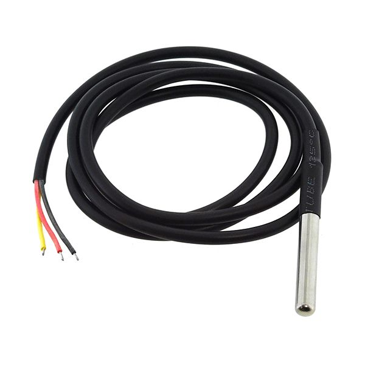

<style>
img {
  display: block;
  margin-left: auto;
  margin-right: auto;
  width: 30em;
}

em {
  text-align: center;
  display: block;
  margin-left: auto;
  margin-right: auto;
  width: 20em;
}

</style>

# Our commitment

Our mission throughout the months has been to built a real-time beehive
monitoring solution for beehives’ owners.  
It is more than ever a need for them, knowing that the world’s bee
population is facing a lot of issues as climate change, habitat loss,
pesticide exposure, predators...

# Hardware development

## The components

This part will be focused on the components used in the development of
the beehive.  
You will learn why we used them and later we will explained how
implement them in your version.

### Arduino MKRWAN

It is an arduino compatible board designed for LoRaWAN communication,
with a low power consumption and a compact size, making it the perfect
solution.


*A picture of the Arduino MKRWAN*

### HX711 Load Cell Amplifier

This component is used in order to monitor the beehive’s weight.  
The weight is a key information because it is an indicator of the hive’s
growth.  
The low-noise analog-to-digital conversion enhance the component’s
accuracy.


*A picture of the HX711 Load Cell Amplifier*

### H401-C3 Load Cell

Connected to HX711 Amplifier this load cell offers high precision and
stability.  
Indeed, it is known for its durability and resistance to environmental
factors.


*A picture of the H401-C3 Load Cell*

### DHT22 Temperature and Humidity Sensors

A hive must have a temperature between 33 and 36 degrees Celsius.  
DHT22 sensors offers a high accuracy to measure both temperature and
humidity.  
The single-wire digital interface ensure a reliable and consistent
readings even in challenging environments.


*A picture of the DHT22 Temperature and Humidity Sensors*

### OneWire Protocol Compatible Temperature Sensors, DS18B20

It provides precise temperature readings for external conditions around
the beehive. These sensors offers an accurate reading of the ambient
environment that the bees are exposed to.


*A picture of the DS18B20 Temperature Sensors*

### Photoresistor

A photoresistor is integrated into the system to measure ambient light
conditions surrounding the beehive


*A picture of the Photoresistor*

### Solar panel

We use it in order to maintain the battery’s charge and to
continuously recharge the LiPo battery during daylight hours.


*A picture of the Solar panels*

### Battery with TPL5110 for Power Management

Powered by a rechargeable LiPo battery[^1], it enhances the autonomy,
and the energy efficiency.  
Indeed, it ensures that the system operates only when necessary.  
There is two main information about the LiPo battery:

1.  It has a nominal voltage of 3.7V and a maximum voltage of 4.2V.

2.  The LiPo’s capacity is rated at 1050mAh. In order to realize the
    battery consumption analysis, we used an Otii ARC-PRO from
    Quoitech.  
    You will find in the "References" section a tutorial in order to get
    started with the device.  


*A picture of the LiPo Battery*


*A picture of the TPL5110*

# PCB Schematic

Before the making of a PCB Schematic, we made tests on a Labdec and we
strongly advise you to do so.  
Once our Labdec worked, we built our PCB Schematic on the same modele.


*A picture of the PCB Schematic*

As you can see, the Arduino MKRWAN pins are redirected to different grove connectors.

The grove connectors are listed below:

- **J1:** Grove connector for the OneWire temperature sensors
- **J2:** Grove connector for the photoresistor
- **J3 & J4:** Connects to the DHT22 temperature and humidity sensors
- **J5:** Grove connector for the HX711 Load Cell Amplifier
- **J6:** Connects to the battery, a voltage divider made of two resistors is integrated in order to measure the battery voltage.
- **J8:** Connects to a LED, it is used to indicate the system’s state.

There is also a 5-pins connector above the Arduino MKRWAN. It is used to connect the TPL5110 to the Arduino MKRWAN. From the second pin to the right, you can notice a wire that connects to the VCC pin of J1-J6. It is used to power the grove connectors only when the system needs to gather data upon emission.


# Software development

This documentation provides a comprehensive overview of the Arduino code used in the Alvearium project. The code is designed for environmental monitoring and data transmission using LoRa connectivity. It includes sensor initialization, data collection, and communication setup.
## Code Structure
### Header Inclusions

```cpp
#include "includes/LoraConnection.hpp"
#include <DHT.h>
#include <OneWire.h>
#include <DallasTemperature.h>
#include <HX711.h>
#include <math.h>
```

 
- `LoraConnection.hpp`: Custom header for LoRa communication handling. 
- `DHT.h`: Library for the DHT22 humidity and temperature sensors. 
- `OneWire.h`: Library for the one-wire protocol, used with Dallas temperature sensors. 
- `DallasTemperature.h`: Library for interfacing with the DallasTemperature sensors. 
- `HX711.h`: Library for the HX711 load cell amplifier. 
- `math.h`: Standard math library for calculations.
### Pin Definitions

```cpp
#define TPL5110_DELAY 10
#define TPL5110_DONE 7
#define DHT22_INTERIOR 4
#define DHT22_EXTERIOR 0
#define ONE_WIRE_BUS 3
#define LOADCELL_DOUT_PIN 8
#define LOADCELL_SCK_PIN 9
#define PERCENTAGE_PIN A6
#define PHOTO_PIN A3
```


- Defines the GPIO pins for various components like TPL5110 power management, DHT22 sensors, and the load cell.
### LoRa Credentials

```cpp
#define APP_EUI "0000000000000000"
#define APP_KEY "C8DFDC187A8281E778015F091DDE04DF"
```


- Credentials for LoRaWAN communication setup.
### Sensor Initializations

```cpp
DHT dhtInterrior(DHT22_INTERIOR, DHT22);
DHT dhtExterior(DHT22_EXTERIOR, DHT22);
OneWire oneWire(ONE_WIRE_BUS);
DallasTemperature sensors(&oneWire);
HX711 scale = HX711();
```


- Initializing DHT22 sensors for interior and exterior measurements.
- Setting up the OneWire protocol and DallasTemperature sensors.
- Initializing the HX711 scale for weight measurements.
### Function Definitions 
- `double getPercentage()`: Calculates battery percentage based on analog voltage readings. 
- `double getLight()`: Measures light intensity using a photoresistor. 
- `double getPreciseLight()`: Computes an average light intensity over multiple readings. 
- `void setupTPL5110()`: Configures TPL5110 module pins for power management. 
- `void startSensors()`: Activates sensors by toggling TPL5110 pins. 
- `void sleepSensors()`: Puts sensors to sleep mode using TPL5110. 
- `void setupEnvironmentSensors()`: Initializes DHT22 and DallasTemperature sensors. 
- `void setupScale()`: Configures the HX711 scale with calibration data. 
- `double getWeight()`: Fetches weight data from the scale. 
- `void setupBattery()`: Initializes pins for battery and light readings.
- 
### Main Setup and Loop Functions
#### setup()
- Initializes serial communication and LoRa connection.
- Sets up power management, sensors, battery, and scale.
- Incorporates a delay for stabilization.
#### loop()
- Manages sensor activation, data reading, and LoRa transmission.
- Collects data from interior/exterior humidity, temperatures, weight, battery, and light sensors.
- Formats and sends the collected data via LoRa.
- Puts sensors into sleep mode and pauses for a defined interval before the next loop iteration.
## Summary

This code forms the backbone of the Alvearium project's environmental monitoring system. It efficiently manages sensor data collection and wireless transmission, ensuring minimal power consumption and reliable data acquisition. The integration of various sensors with LoRa connectivity exemplifies a well-orchestrated IoT application in environmental monitoring.

## Requirements

You must have an Arduino MKR WAN, a functionnal version of Arduino IDE,
in order to download your code into the MKR WAN.  
You also must have a LoRaWAN Connectivity and a network provider.  
We chose The things Network, but feel free to use the one you feel
confortable with. You will find in the "References" section a tutorial
to get started with the device and the network provider.

## Setup

## Functions

# Tests on the prototype

# Acknowledgments

We would like to thank our teachers: M. Viateur & M.Douze for the
insights and the advice they gave us throughout the conception of the
project.

# References

## Arduino MKR WAN and TTN Tutorial

<https://moodle-sciences-23.sorbonne-universite.fr/pluginfile.php/155165/mod_resource/content/1/Tutorial%20carte%20MKRWAN1310.pdf>

## Otii ARC-PRO

<https://www.mouser.fr/ProductDetail/Qoitech/OTII-ARC-PRO?qs=Y0Uzf4wQF3kqnNxTtPdiJg%3D%3D>

## Getting started with Otii ARC-PRO

<https://moodle-sciences-23.sorbonne-universite.fr/pluginfile.php/215913/mod_resource/content/1/TP_Mesure_conso_MKRWAN_1310_2023.pdf>

[^1]: LiPo stands for Lithium-Polymer
